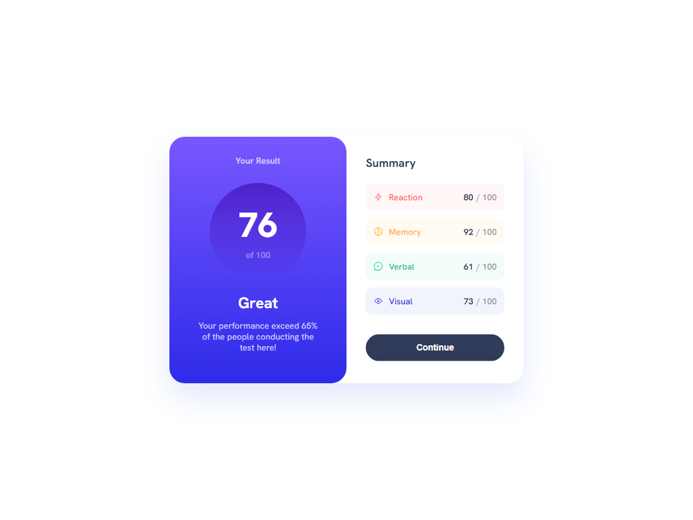

# Frontend Mentor - Results summary component solution

This is a solution to the [Results summary component challenge on Frontend Mentor](https://www.frontendmentor.io/challenges/results-summary-component-CE_K6s0maV). Frontend Mentor challenges help you improve your coding skills by building realistic projects. 

## Table of contents

- [Overview](#overview)
  - [The challenge](#the-challenge)
  - [Screenshot](#screenshot)
  - [Links](#links)
- [My process](#my-process)
  - [Built with](#built-with)
  - [What I learned](#what-i-learned)
  - [Continued development](#continued-development)
  - [Useful resources](#useful-resources)
- [Author](#author)
- [Acknowledgments](#acknowledgments)

## Overview

### The challenge

Users should be able to:

- View the optimal layout for the interface depending on their device's screen size
- See hover and focus states for all interactive elements on the page
- **Bonus**: Use the local JSON data to dynamically populate the content

### Screenshot

#### Desktop (1440x1080)

#### Mobile (375x809)

### Links

- Solution URL: [Add solution URL here](https://github.com/kinqbert/results-summary-component)
- Live Site URL: [Add live site URL here](https://kinqbert.github.io/results-summary-component/)

## My process

### Built with

- Semantic HTML5 markup
- CSS custom properties
- Flexbox
- Desktop-first workflow
- BEM
- MEdia queries

### What I learned

During development I had a lot of practice with flexboxes and basic adaptation for different devices. Also I've a lot of practice with BEM methodology and firstly tried gradients in CSS.

### Continued development

- Add usage of local JSON data to dynamically populate the content

## Author

- GitHub - [@kinqbert](https://github.com/kinqbert)
- Discord - [@kinqbert](https://discordapp.com/users/kinqbert)
- Telegram - [@kinqbert](https://t.me/perekhodko_m)
- Frontend Mentor - [@kinqbert](https://www.frontendmentor.io/profile/kinqbert)
- LinkedIn - [Maksym Perekhodko](https://www.linkedin.com/in/maksym-perekhodko/)
